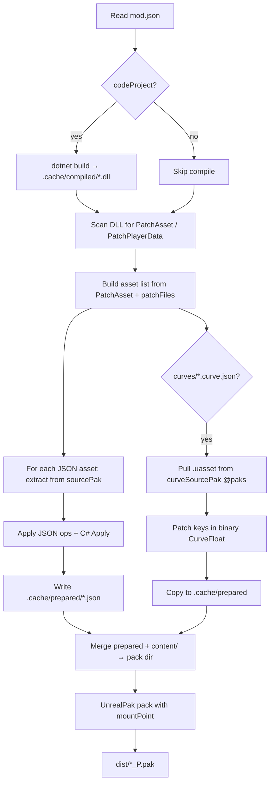

# How utool works (Icarus workspace: noquarrites / 250cap)

This document explains **utool** — the CLI from the [utool](https://github.com/0bArc/utool) repo — and how it decides **what to patch**, **which game file**, and **how that becomes a `*_P.pak`** you drop into Icarus.

Example layout (your paths may differ):

- **Mod workspace:** `F:\Data\personal\c#\modding\ICARUS\noquarrites` — `mods/`, `utool.json`
- **UTool repo:** clone of this repo — build → `dist\utool\utool.exe`
- **Mods:** `mods\250cap`, `mods\noquarrites`

---

## 1. What utool is

| Piece | Role |
|-------|------|
| **utool** | .NET 8 CLI (`AssemblyName` = `utool`), output in `<repo>\dist\utool\` |
| **mod.json** | Per-mod manifest: id, game target, output pak, **sourcePak**, **mountPoint** |
| **C# patches** | `[PatchAsset("D_SomeFile.json")]` — edit JSON via `JsonAssetEditor` |
| **JSON patches** | Optional `patchFiles` — declarative ops, no compile |
| **Curve patches** | `curves\*.curve.json` — patch binary `CurveFloat` `.uasset` / `.uexp` |
| **UnrealPak** | Packs prepared files into UE4 override pak (`_P.pak` convention on Icarus) |

You never hand-edit `data.pak`. You describe changes; utool **extracts vanilla → patches → repacks**.

---

## 2. One-time setup

### Build utool

```powershell
cd F:\Data\personal\c#\utool   # or your clone path
dotnet run --project build.csproj -c Release
$env:PATH = "F:\Data\personal\c#\utool\dist\utool;" + $env:PATH
utool help
```

(`build.ps1` does the same and bumps version in `Directory.Build.props`.)

### Workspace config (`utool.json`)

utool walks **up** from the mod directory until it finds **`utool.json`** (legacy **`csstratware.json`** still read). For noquarrites that file is at the workspace root.

Copy [utool.json.example](../utool.json.example) and point at Steam Icarus:

```json
{
  "games": {
    "Icarus": {
      "paksDir": "D:\\SteamLibrary\\steamapps\\common\\Icarus\\Icarus\\Content\\Paks",
      "dataPak": "D:\\SteamLibrary\\steamapps\\common\\Icarus\\Icarus\\Content\\Data\\data.pak",
      "playerDataDir": "C:\\Users\\you\\AppData\\Local\\Icarus\\Saved\\PlayerData"
    }
  },
  "extractedDir": "extracted"
}
```

Top-level `dataPak` / `gamePaksDir` / legacy `icarusDataPak` / `icarusPaksDir` also work (see `UToolConfig`).

| Key | Used for |
|-----|----------|
| `games.Icarus.dataPak` | `@data` / `@icarus-data` → vanilla JSON source |
| `games.Icarus.paksDir` | `@paks` / `@icarus` → all `*.pak` in Content/Paks (**curves**) |
| `games.Icarus.playerDataDir` | Conditional mods (noquarrites) — save accolades |
| `extractedDir` | Optional pre-extracted tree; skips UnrealPak if filename found there |

### UnrealPak

Icarus override paks need UnrealPak. First `pak build-mod` may extract `<utool-repo>\assets\UnrealPak.zip`, or run:

```powershell
utool setup unrealpak
```

See [assets/README.md](../assets/README.md).

---

## 3. End-to-end pipeline (`pak build-mod`)

```powershell
cd F:\Data\personal\c#\modding\ICARUS\noquarrites
utool validate mods
utool pak build-mod mods\250cap
# or
utool pak build-mod mods\noquarrites
```



### Cache folders (per mod)

| Path | Contents |
|------|----------|
| `.cache/compiled/` | Built mod DLL |
| `.cache/source/` | Cached vanilla JSON (`.sha256` sidecar) |
| `.cache/ue-extract/` | Temp UnrealPak extract per filter |
| `.cache/prepared/` | **Final** files that go into the pak |
| `.cache/curve-source/` | Vanilla `.uasset` / `.uexp` for curves |
| `.cache/pack-content/` | Merged tree if you also have `content/` roots |

Incremental: unchanged inputs → prepare may skip. `--force-extract` refreshes from game.

---

## 4. How utool knows **what file** to patch

### Rule 1: Asset **file name**, not a UE path

For JSON tables, target is the **filename inside the pak**, e.g. `D_CharacterGrowth.json`.

**C#:**

```csharp
[PatchAsset("D_CharacterGrowth.json")]
public sealed class Level250CapGrowthPatch : AssetPatch { ... }
```

**JSON-only:** `patches/foo.json` → `"assetPath": "D_ProcessorRecipes.json"`.

utool loads `[PatchAsset]` from the compiled DLL (`ModCodePatchRunner.LoadAssetPatches`).

### Rule 2: Vanilla JSON — `pak.sourcePak`

```json
"pak": {
  "sourcePak": "@data"
}
```

`@data` → `utool.json` → `games.Icarus.dataPak` → `...\Content\Data\data.pak`.

Prepare per asset:

1. `.cache/source/D_Foo.json` (valid hash)
2. Else workspace `extracted/`
3. Else UnrealPak extract from `sourcePak` with filter `*D_Foo.json*`
4. Patch → `.cache/prepared/D_Foo.json`

Wrong name → `UnrealPak did not extract 'D_Foo.json'`.

**Find names first:**

```powershell
utool pak find @paks Quarrite --path-only
utool pak find @paks CharacterGrowth --path-only
utool pak data list @paks --pattern *AISpawn* --ext .json
```

### Rule 3: In-game path — `pak.mountPoint`

| Mod | mountPoint | Meaning |
|-----|------------|---------|
| **250cap** | `../../../Icarus/Content/Data/Character/` | Character data |
| **noquarrites** | `../../../Icarus/Content/data/AI/` | AI tables |

Wrong mount → mod loads but **game ignores** changes.

### Rule 4: Curves — `curves/*.curve.json` + `curveSourcePak`

```json
"sourcePak": "@data",
"curveSourcePak": "@paks"
```

Each `curves\*.curve.json` needs `assetName`, `minPatchTime`, `keys`. **`assetName`** drives extract/output name.

250cap curves (from `scripts/Generate-CurvePatches.ps1`): `C_PlayerExperienceGrowth`, `C_PlayerTalentGrowth`, `C_PlayerBlueprintGrowth`, `C_SoloTalentGrowth`.

---

## 5. Mod walkthrough: **250cap**

| Field | Value | Effect |
|-------|-------|--------|
| `codeProject` | `code/Level250Cap.csproj` | Patch DLL |
| `pak.sourcePak` | `@data` | `D_CharacterGrowth.json` from `data.pak` |
| `pak.curveSourcePak` | `@paks` | Curve `.uasset` from Content/Paks |
| `pak.mountPoint` | `../../../Icarus/Content/Data/Character/` | Icarus pack path |
| `pak.output` | `dist/level250cap_P.pak` | Output |
| `pak.useUnrealPak` | `true` | Required for Icarus |

```powershell
cd F:\Data\personal\c#\modding\ICARUS\noquarrites
utool validate mods\250cap
utool compile mods\250cap          # optional; build-mod compiles anyway
utool pak build-mod mods\250cap
```

**Output:** `mods\250cap\dist\level250cap_P.pak`

Regenerate curves:

```powershell
cd mods\250cap\scripts
.\Generate-CurvePatches.ps1 -MaxLevel 250
utool pak build-mod ..\250cap --force-extract
```

---

## 6. Mod walkthrough: **noquarrites**

| Field | Value |
|-------|-------|
| `pak.sourcePak` | `@data` |
| `pak.mountPoint` | `../../../Icarus/Content/data/AI/` |
| `pak.output` | `dist/removeQuarrites.pak` |
| No `curveSourcePak` | JSON-only |

Six `[PatchAsset]` classes in `removeQuarrites.cs` → six JSON tables prepared in one `build-mod`.

Conditional gate: `saves.AnyProfileHasCompletedAccolade("DefeatQuarrite")` — if no profile qualifies, assets **skipped** at prepare.

```powershell
utool playerdata status mods\noquarrites
utool playerdata list
utool pak build-mod mods\noquarrites
```

**Output:** `mods\noquarrites\dist\removeQuarrites.pak` (consider `*_P.pak` suffix in `pak.output` if load order issues).

---

## 7. New patch checklist

1. `utool pak find @paks YourNeedle --path-only`
2. `utool pak data list @paks --pattern *YourFile* --ext .json`
3. `sourcePak`: `@data` for `data.pak` JSON
4. `mountPoint` matches vanilla virtual tree
5. C# `[PatchAsset("ExactFileName.json")]` or `patchFiles`
6. Build from workspace root (so `utool.json` is found)
7. `utool pak list mods\your-mod\dist\your-mod_P.pak`

---

## 8. Command reference

| Command | Purpose |
|---------|---------|
| `utool validate <mods-dir>` | Check mod.json + layout |
| `utool compile <mod-dir> [--prepare]` | Build DLL; `--prepare` runs JSON prepare |
| `utool pak build-mod <mod-dir>` | Full pipeline → dist pak |
| `utool pak build-mod <mod> --force-extract` | Refresh from game |
| `utool pak find @paks <needle>` | Locate assets |
| `utool pak list <file.pak>` | List pak entries |
| `utool playerdata status <mod-dir>` | Conditional mod gate |
| `utool pak ue extract <data.pak> extracted --filter *D_Foo*` | Manual extract |

**Aliases** (`UToolConfig`):

| Token | Resolves to |
|-------|-------------|
| `@data`, `@icarus-data`, `@game-data`, `@config:data` | `dataPak` |
| `@paks`, `@icarus`, `@game-paks`, `@config:paks` | All `*.pak` in `paksDir` |

---

## 9. Troubleshooting

| Symptom | Likely cause | Fix |
|---------|--------------|-----|
| `dataPak not configured` | No `utool.json` in parent dirs | Workspace root; fix `dataPak` |
| `did not extract 'D_X.json'` | Wrong `[PatchAsset]` or wrong pak | `pak find`; fix name or `sourcePak` |
| Mod builds, game unchanged | Wrong `mountPoint` or mod off | `pak list`; compare mount |
| noquarrites few files | No `DefeatQuarrite` save | Beat Quarrite or drop conditional base |
| Curve mod fails | Missing `curveSourcePak` / `assetName` | `@paks`; `pak find @paks C_PlayerExperience` |
| UnrealPak error | Toolchain missing | `utool setup unrealpak` or `assets/UnrealPak.zip` |

---

## 10. Repo map (implementation)

| File | Responsibility |
|------|----------------|
| `src/UTool.Cli/PakCommands.cs` | `build-mod` orchestration |
| `src/UTool.Pak/ModAssetPreparer.cs` | Extract + patch JSON |
| `src/UTool.Pak/ModCurvePreparer.cs` | Extract + patch curves |
| `src/UTool.ModLoader/ModCodePatchRunner.cs` | `[PatchAsset]` discovery |
| `src/UTool.Cli/UToolConfig.cs` | `@data` / `@paks` resolution |
| `src/UTool.Sdk/AssetPatch.cs` | Mod author API |

Docs: [docs/setup.md](setup.md), [README.md](../README.md), [src/README.md](../src/README.md).

---

## 11. Quick copy-paste

```powershell
$env:PATH = "F:\Data\personal\c#\utool\dist\utool;" + $env:PATH
cd F:\Data\personal\c#\modding\ICARUS\noquarrites

utool validate mods
utool pak build-mod mods\250cap
utool pak build-mod mods\noquarrites

utool pak list mods\250cap\dist\level250cap_P.pak
utool pak list mods\noquarrites\dist\removeQuarrites.pak
```

Install built paks per your Icarus mod loader.
